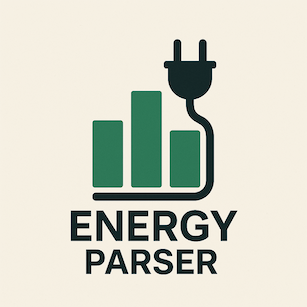

<!-- PROJECT INFO -->
[![Contributors][contributors-shield]][contributors-url]
[![Forks][forks-shield]][forks-url]
[![Stargazers][stars-shield]][stars-url]
[![Issues][issues-shield]][issues-url]
[![License][license-shield]][license-url]

<!-- PROJECT LOGO -->
 

  

  <h3 align="center">Energy Data Collector</h3>

  

    A parser designed to fetch energy data from different APIs and provide dataframes of consistent structure 
     
     
    <a href="https://github.com/mt7180/EnergyDataParser/blob/main/examples">View Demo</a>
    ·
    <a href="https://github.com/mt7180/EnergyDataParser/issues">Report Bug</a>
    ·
    <a href="https://github.com/mt7180/EnergyDataParser/issues">Request Feature</a>
  

<!-- LINKS -->
<!-- https://www.markdownguide.org/basic-syntax/#reference-style-links -->
[contributors-shield]: https://img.shields.io/github/contributors/mt7180/EnergyDataParser.svg?style=for-the-badge
[contributors-url]: https://github.com/mt7180/EnergyDataParser/graphs/contributors
[forks-shield]: https://img.shields.io/github/forks/mt7180/EnergyDataParser.svg?style=for-the-badge
[forks-url]: https://github.com/mt7180/EnergyDataParser/network/members
[stars-shield]: https://img.shields.io/github/stars/mt7180/EnergyDataParser.svg?style=for-the-badge
[stars-url]: https://github.com/mt7180/EnergyDataParser/stargazers
[issues-shield]: https://img.shields.io/github/issues/mt7180/EnergyDataParser.svg?style=for-the-badge
[issues-url]: https://github.com//miratheidel/EnergyDataParser/issues
[license-shield]: https://img.shields.io/github/license/mt7180/EnergyDataParser.svg?style=for-the-badge
[license-url]: https://github.com//mt7180/EnergyDataParser/blob/main/LICENSE